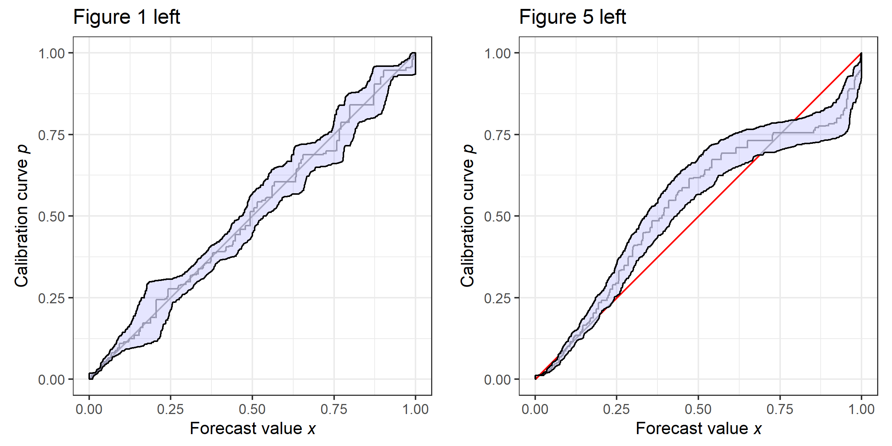

### Citation

T. Dimitriadis, L. Dümbgen, A. Henzi, M. Puke, and J. Ziegel. Honest calibration assessment for binary outcome predictions. *Preprint*, [*arXiv:...*](https://doi.org/...), 2022. 


### Associated repository

```{r eval=FALSE, include=T}
#install.packages("devtools")
devtools::install_github("marius-cp/calibrationband")
library(calibrationband)
```


### Simulations 

All graphs in chapter 5 can be replicated based on the code in the folder `simulation`. 
The simulation results can be obtained using the script `simulation.R`.  

### Application

The code in the respective folder allows to replicate Figure 1 and 5. The data preparation is carried out in `data_preperation.R` and requires that the following data set has been downloaded in advance (https://data.nber.org/natality/2017/natl2017.dta.zip). The user manual is to be found here https://data.nber.org/natality/2017/natl2017.pdf. A cleaned version of the data (randomly split into a test and training set) is provided in `bw_train.RDS` and `bw_test.RDS`.


<p align="middle">
  
</p>


All plots were created with the `calibrationband` library. 
